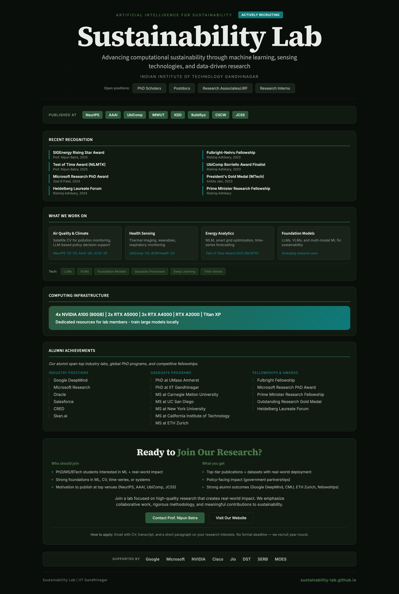
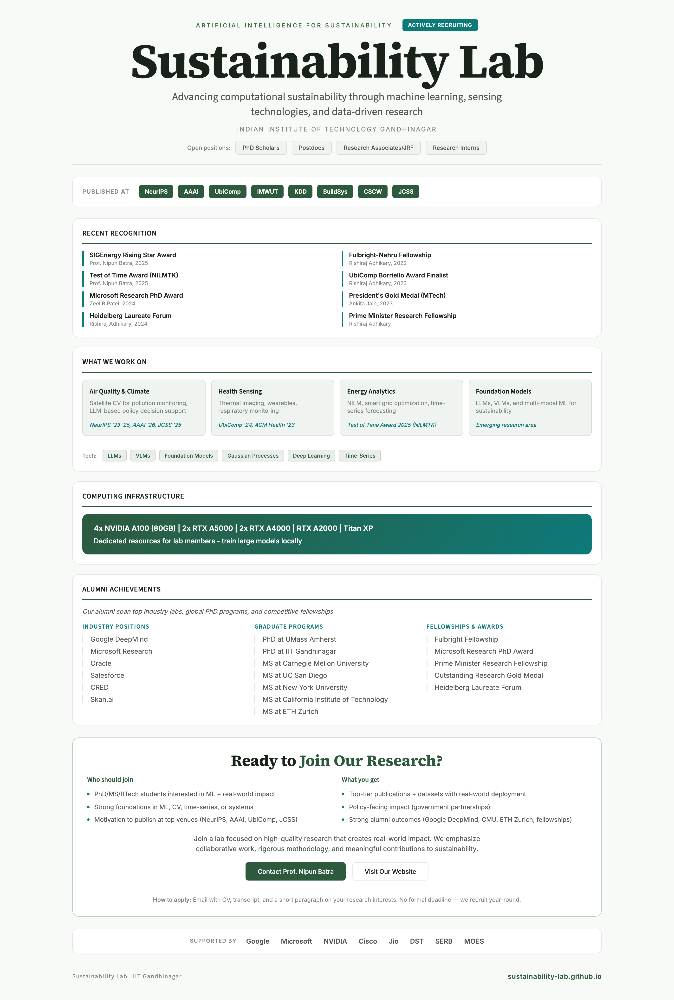

# Sustainability Lab Recruitment Poster

Join Us recruitment poster for Sustainability Lab at IIT Gandhinagar.

## Preview

### Dark Theme


### Light Theme


## Live Preview

View the interactive HTML versions:
- [Dark Theme](https://nipunbatra.github.io/sustainability-lab-poster/sustainability-lab-join-us-poster.html)
- [Light Theme](https://nipunbatra.github.io/sustainability-lab-poster/sustainability-lab-join-us-poster-light.html)

## Files

- `sustainability-lab-join-us-poster.html` - Dark theme poster
- `sustainability-lab-join-us-poster-light.html` - Light theme poster
- `sustainability-lab-join-us-poster.pdf` - Dark theme PDF
- `sustainability-lab-join-us-poster-light.pdf` - Light theme PDF

## Generating PDFs

Requires [Node.js](https://nodejs.org/) and [Puppeteer](https://pptr.dev/).

```bash
# Install dependencies
npm install

# Generate both PDFs
make all

# Or generate individually
make dark    # Dark theme only
make light   # Light theme only
```

## Makefile Targets

- `make all` - Generate both PDFs
- `make dark` - Generate dark theme PDF only
- `make light` - Generate light theme PDF only
- `make clean` - Remove generated PDFs
- `make open` - Open both PDFs in default viewer
- `make watch` - Generate PDFs on file changes

## Tech Stack

- HTML5 + CSS3
- Google Fonts (Source Sans 3, Source Serif 4, Inter)
- Puppeteer for PDF generation
