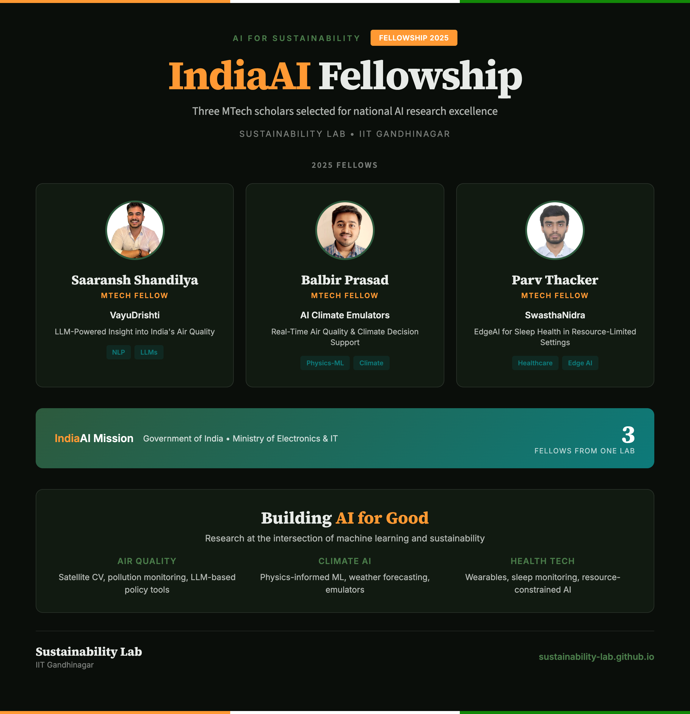
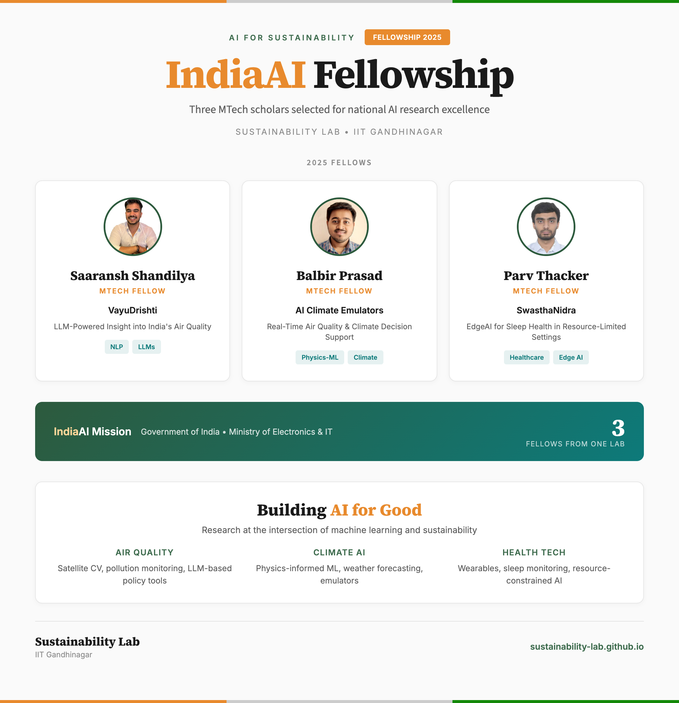
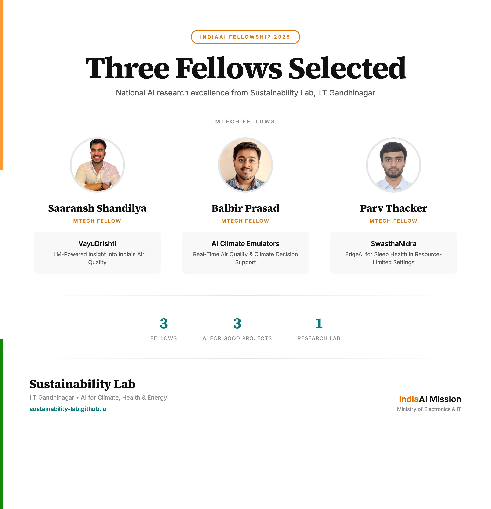
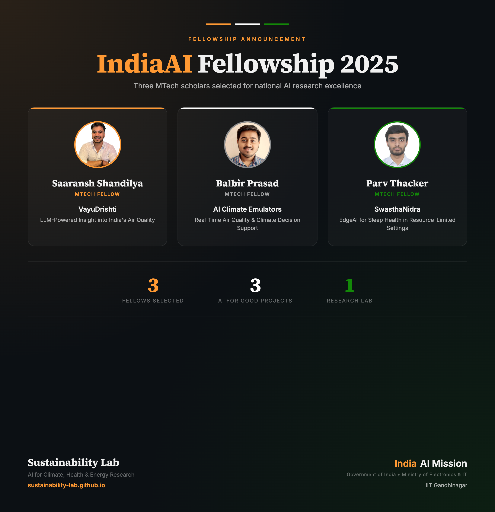

# Sustainability Lab Posters

Design assets and posters for the [Sustainability Lab](https://sustainability-lab.github.io) at IIT Gandhinagar.

## Live Gallery

**[View all posters →](https://nipunbatra.github.io/sustainability-lab-poster/)**

## Poster Collections

### IndiaAI Fellowship 2025

Celebrating three MTech scholars selected for the prestigious IndiaAI Fellowship:

- **Saaransh Shandilya** — VayuDrishti: LLM-Powered Insight into India's Air
- **Balbir Prasad** — AI-Driven Emulators for Real-Time Air Quality & Climate Decision Support
- **Parv Thacker** — SwasthaNidra: EdgeAI for Sleep Health in Resource-Limited Settings

**[View posters →](https://nipunbatra.github.io/sustainability-lab-poster/india-ai-fellowship/)**

| Variant | Preview |
|---------|---------|
| Clean Dark |  |
| Clean Light |  |
| Minimal White |  |
| Tricolor Accent |  |

### Join the Lab (Recruitment)

Recruitment posters for PhD, Postdoc, Research Associate, and Intern positions.

**[View posters →](https://nipunbatra.github.io/sustainability-lab-poster/join-us/)**

Available in 8 color variants (4 dark + 4 light themes):
- Green, Blue, Earth, Purple

## Folder Structure

```
sustainability-lab-poster/
├── index.html                    # Main gallery page
├── india-ai-fellowship/          # IndiaAI Fellowship posters
│   ├── index.html               # Fellowship gallery
│   ├── *.html                   # Poster HTML files
│   ├── *.png                    # Poster images
│   └── generate-all.mjs         # PNG generation script
├── join-us/                      # Recruitment posters
│   ├── index.html               # Recruitment gallery
│   ├── *.html                   # Poster HTML files
│   ├── *.png                    # Poster images
│   └── *.pdf                    # PDF versions
└── README.md
```

## Generating Images

Requires [Node.js](https://nodejs.org/) and [Puppeteer](https://pptr.dev/).

```bash
# Install dependencies
npm install

# Generate IndiaAI Fellowship PNGs
node india-ai-fellowship/generate-all.mjs

# Generate recruitment poster PDFs
make all
```

## Tech Stack

- HTML5 + CSS3
- Google Fonts (Source Sans 3, Source Serif 4, Inter)
- Puppeteer for PDF/PNG generation
- GitHub Pages for hosting

## License

These posters are for Sustainability Lab, IIT Gandhinagar use.
